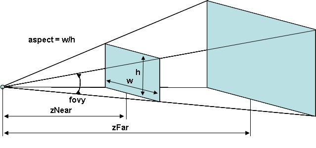

# 3D Object Viewer - Documentation for programmer

### Content
- Overview
- UI
- Importing object
- Scene and Interaction
  - OpenGL Translate/Rotate/Scale
- Object information and export
- FullView (Bonus)
- Process of the program
- End words

## Overview
---
I wanted to make some viewport application that could simply show you wireframe of any 3D object. You are able to move, rotate and scale it around the 3D scene. The program also can provide you with various information about the project and export all vertices and faces in csv file.
## UI
---
For my UI I chose PyQt5 library, because of easy implementation, support of Style Sheets which I used and also a lot of nice features that simply wasn't possible in TkInter, or not that easily. 

In drivers code I just initialize all the UIs.<br>
Then creating the UI is in a function and everything there is a simple.
This is a simple example of a code that creates a button and gives him a even function.
```python
self.btn_WireFrame = QtWidgets.QPushButton(self.centralwidget)
        self.btn_WireFrame.setGeometry(QtCore.QRect(260, 140, 171, 41))
        font = QtGui.QFont()
        font.setFamily("Segoe UI Light")
        font.setPointSize(1)
        self.btn_WireFrame.setCursor(QCursor(QtCore.Qt.PointingHandCursor))
        self.btn_WireFrame.setFont(font)
        self.btn_WireFrame.setStyleSheet("StyleSheets code")
        self.btn_WireFrame.setObjectName("btn_WireFrame")
        self.btn_WireFrame.raise_()
        self.btn_WireFrame.clicked.connect(ShowWireFrame)
``` 
There is this function for all the text in the UI. It's function by itself and not implemented in the main function because if I wanted to have this program in more languages I just translate them and put all the texts here with a if statement that would depend on a user. I didn't implement it because in this project it wasn't very usefull, but for next and bigger projects it's great.
```python
 def retranslateUi(self, MainWindow):
        _translate = QtCore.QCoreApplication.translate
```
## Import
---
I'm loading .obj files, and it have a reason why this one. Obj file is the only one 3D File that has simple structure, it's easily understandable and after some research I found out that there is a library thas has a obj reader already implemented. By one line I can read the object and save all the data that I'll need for my recreating
```python
scene = pywavefront.Wavefront(objname, collect_faces=True)
```
After this I'm working with scene, to set up size, scaling and tranforming for future. For example creating size is just picking the highest and lowest vertices and then putting them into scene_box. All the first creation of the object is just putting the object in the right stop with the right scale, that I calculated and saved in these variables
 ```python
scene_size     = [scene_box[1][i]-scene_box[0][i] for i in range(3)]
max_scene_size = max(scene_size)
scaled_size    = 5
scene_scale    = [scaled_size/max_scene_size for i in range(3)]
scene_trans    = [-(scene_box[1][i]+scene_box[0][i])/2 for i in range(3)]
```

The real calculations of the mesh and all his vertices are done in function "Model" Where I fist set up the scale and tranform, as I said. After that there is a the most important loop which puts all vertices in the place
```python
 for mesh in scene.mesh_list:
        glBegin(GL_TRIANGLES)
        for face in mesh.faces:
            for vertex_i in face:
                count_vertex += 1
                glVertex3f(*scene.vertices[vertex_i])
        glEnd()
```
glBegin is a start function in the OpeGL where all vertices should be created. So I go through all faces in the mesh and all the vertices of the faces and generate them by glVertex3f and scne.vertices where I have all my vertices saved. 
## Scene and Interaction
---
Main scene is created with PyGame. PyGame is build to support 3D Graphics and it also has one of the best implementations for input keys and interaction. I just created the main scene and then used OpenGL and Pywavefront for all the object calculations. 

After scene loads I run the main loop where I have all the keybinds and also the model and viewport loading.
```python
 quitPygame = False
 while not quitPygame:
        for event in pygame.event.get():
```
For the movement and so on, I use pygame.event where check for each input and then I use the GlTranslate/Scale/Rotation:
```python
if event.type == pygame.MOUSEMOTION:
        if ms_l_button_down == True:
                glRotatef(event.rel[1], 1, 0, 0)
                glRotatef(event.rel[0], 0, 1, 0)
```
For example here I check if there is any input from a mouse and if its a left button then I rotate the object. Event.rel is a tuple with two arguments (rel_x, rel_y), where rel_x is a mouse position relative on previous position on x-axis in pixels. glRotatef takes (angle,x,y,z) args, so I use that position for angle and then just constant values for axis. For translate and scale almost the same.

### How OpenGL Translation/Rotation/Scale works
Simply said OpenGL computes with matrixes, so every movement, rotation etc. is just a multiplication the current matrix with another matrix. For exaplme let's look how exactly GlTranslatef works and how it calculate. <br>
We will take a simple Matrix(A), which we can say is a matrix of our model.

$$\begin{equation*}
A = 
\begin{pmatrix}
1 & 0 & 0 & 0\\
0 & 1 & 0 & 0\\
0 & 0 & 1 & 1\\
0 & 0 & 0 & 1
\end{pmatrix}
\end{equation*}$$

Translation of this model, or matrix is just multiplication with Translate matrix which looks like this
```python
glTranslatef(tx, ty, tz)
```
$$\begin{equation*}
T = 
\begin{pmatrix}
1 & 0 & 0 & tx\\
0 & 1 & 0 & ty\\
0 & 0 & 1 & tz\\
0 & 0 & 0 & 1
\end{pmatrix}
\end{equation*}$$

Where tx,ty and tz are numbers that shows how much the model should be moved on specific axis. Let's say we want to move that object by 5 to the left. We could say that from axis graph that left side is negative X.

$$\begin{equation*}
T = 
\begin{pmatrix}
1 & 0 & 0 & -5\\
0 & 1 & 0 & 0\\
0 & 0 & 1 & 0\\
0 & 0 & 0 & 1
\end{pmatrix}
\end{equation*}$$

And now we just have to multiply our matrix with this, as we know matrix multiplication isn't commutative so the first matrix is our model and second is the translate matrix.

$$\begin{equation*}
A = 
\begin{pmatrix}
1 & 0 & 0 & 0\\
0 & 1 & 0 & 0\\
0 & 0 & 1 & 1\\
0 & 0 & 0 & 1
\end{pmatrix}
*
T = 
\begin{pmatrix}
1 & 0 & 0 & -5\\
0 & 1 & 0 & 0\\
0 & 0 & 1 & 0\\
0 & 0 & 0 & 1
\end{pmatrix}
=\begin{pmatrix}
1 & 0 & 0 & -5\\
0 & 1 & 0 & 0\\
0 & 0 & 1 & 1\\
0 & 0 & 0 & 1
\end{pmatrix}
\end{equation*}$$

And thats our new object matrix.<br>
For rotation in 3D space it's little bit more complicated than tranlation. For rotation we have 3 different matrixes for all axis.
```python
glRotatef(A, x, y, z)
```
$$\begin{equation*}
Rx = 
\begin{pmatrix}
1 & 0 & 0 & 0\\
0 & cos(A) & -sin(A) & 0\\
0 & sin(A) & cos(A) & 0\\
0 & 0 & 0 & 1
\end{pmatrix}
\end{equation*}$$

$$\begin{equation*}
Ry = 
\begin{pmatrix}
cos(A) & 0 & sin(A) & 0\\
0 & 1 & 0 & 0\\
-sin(A) & 0 & cos(A) & 0\\
0 & 0 & 0 & 1
\end{pmatrix}
\end{equation*}$$

$$\begin{equation*}
Rz = 
\begin{pmatrix}
cos(A) & -sin(A) & 0 & 0\\
sin(A) & cos(A) & 0 & 0\\
0 & 0 & 1 & 0\\
0 & 0 & 0 & 1
\end{pmatrix}
\end{equation*}$$
A is a rotations angle and the x, y and z parameters are just boolean where we put 1 and zeroes depending on which axis we want to rotate.<br>
Last transformation I used was scale which is again easy. Scaling is interpreted as multiplying any dimension of the target object by a scalar. This scalar can be <1 if we want to shrink the object, and it can be >1 if we want to enlarge the object. The matrix looks like this
```python
glScaled(x, y, z)
```
$$S = 
\left(\begin{array}{cc} 
sx & 0 & 0 & 0\\
0 & sy & 0 & 0\\
0 & 0 & sz & 0\\
0 & 0 & 0 & 1\\
\end{array}\right)$$
The last important function which is not clear is perspective<br>

    gluPerspective(fovy, aspect, zNear, zFar)

- <b>Fovy</b> - Basically the angle in between a plane passing through the camera position as well as the top of your screen and another plane passing through the camera position and the bottom of your screen. The bigger this angle is, the more you can see of the world - but at the same time, the objects you can see will become smaller.
- <b>Aspect</b> - The aspect ratio, which controls the horizontal viewing angle. For a non-stretched perspective, aspect should be the ratio of the screen width to height. For example, on a 640×480 display, aspect should be 4/3.
- <b>zNear</b> - Distance between the camera and the nearest clipping plane. That means everything in between the distane won't be rendered
- <b>zFar</b> - Same as zNear but this is with the farest clipping plane. Also everything behind it won't be rendered. Having this as really high value can cause flickering and can break the model<br>
The matrix isn't that important to know as to understand the args. But I'll show the matrix anyways
$$\left(\begin{array}{cc} 
\frac{f}{aspect} & 0 & 0 & 0\\
0 & f & 0 & 0\\
0 & 0 & \frac{zFar+zNear}{zNear-zFar} & \frac{2 * zFar*zNear}{zNear-zFar}\\
0 & 0 & -1 & 0\\
\end{array}\right)$$
Where
$$f = cotangent(\frac{fovy}{2})$$
## Object information and export
---
There are two main buttons that can provides you with information about the object. First is the "Show Info" button. The function itself is easy, just printing string. I save the information all along the program, when u select a object, the size of the file will be saved and when you load the object, in the main loop where all the vertices are loaded I save all vertices and faces. All the variables I pass to function <b>Statistics()</b> where I put everything together.<br>
For export into the data.csv I'm importing csv where I create a writer
```python
writer = csv.writer(open("data.csv", "wt"), quoting=csv.QUOTE_NONE, escapechar=' ')
```
And I write variables that I take from another function in the Viewport.py <b>Export():</b> I have vertices stored in list of lists. So for better workflow with the writer I convert the list into a string, same with the faces, there is a small difference, because faces are stored in a list but as a tuples.
```python
for i in range(len(scene.vertices)):
        v_data += (str(scene.vertices[i]) + "\n")
for a in range(len(data_f)):
        f_data += (str(data_f[a]) + "\n")
```

## Fullview
---
In the fullview I used Pyglet instead of Pygame which I should do in the start of this project. There is main function which is called by the button. It creates and sets up the window<br>
After that there is draw_object function, which sets up the object and then draws it
```python
def draw_object(object, x, y):
    #I'm moving the object to the right spot and then drawing him
    glLoadIdentity()
    glTranslated(x,y, -10.0)
    glRotatef(rotation, 0.0, 1.0, 0.0)
    visualization.draw(object)
```
In the end its almost the same process as in the viewport but easier. I didn't had time to do user input as I did in the viewport, so I atleast created rotation method which is called every tick and rotates the object on y-axis
```python
def update(dt):
    global rotation
    rotation += 90.0 * dt
    if rotation > 360:
        rotation = 0
```
## Process
---
### OpenGL vs Own reader
I knew that I wanted to do this program with OpenGL, but there was a big problem with the reading of the file. I tried to make myself my own reader. I learnt about object file, how are they created and what every single line in the file means. So I made up reader that imports all the data from the object file into tuples, but then there was a problem with OpenGL, because in that time I didn't know how exactly OpenGL works and loads the object, so after that I found out that I have to rewrite the whole reader and learn a lot of new stuff that I didn't have time for. So I searched and I found out there is a Pywavefront, which nicely collaborates with OpenGL, so I used it.<br>
### UI
For the UI as I said, I went throught TkInter but after trying some designs I knew that it won't work as I want to. So I found PyQt5 which in my opinion is best library for UI.<br>
### Pygame or Pyglet?
The last question is why I  used pygame as the main view window. The easy explanation is that I already knew about pygame and I had a little knowledge about it. So I started using pygame without even thinking that I could use something else, which in the end is wrong decision and I regret doing that. Pygame has easy implementation of keybinds and the whole user input is just elegantly processed. But the visualisation is compared to pyglet worse, in my opinion. I struggled several hours with Fullview in pygame, but with pyglet I was able to do that really easily. And the main problem with that is pygame and pyglet are both libraries that are windows and when I have both of them in one project, things goes wrong. That's why you have to load FullView first

## End Words
---
The whole process of putting it all together was really fun and I learnt a lot of new stuff, mostly about OpenGL and I'm ready to use OpenGL in the following projects as well.

