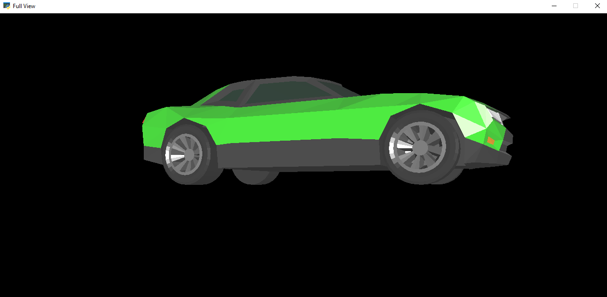
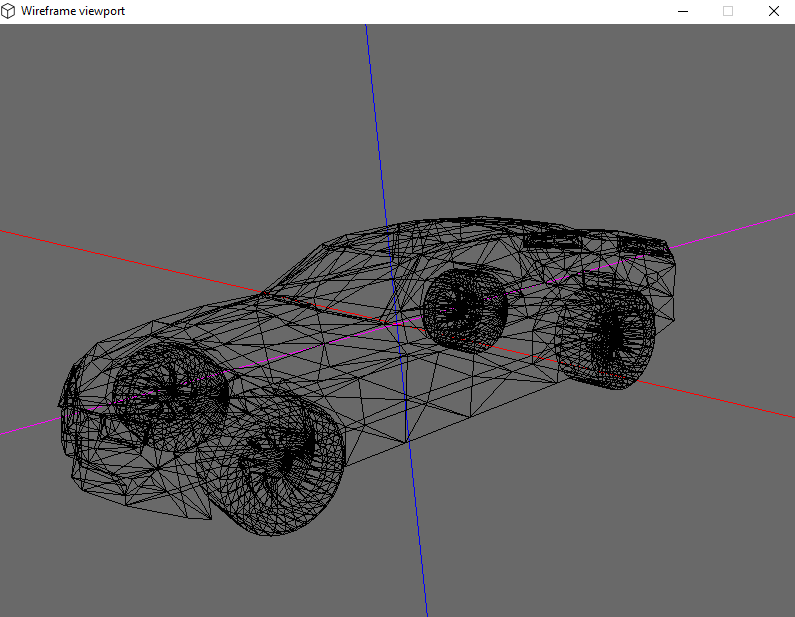

# 3D Object Viewer

### Content
- Overview
- Menu guide
- Wireframe viewport guide
- Full View - Comming Soon - maybe
## Overview
---
If you are 3D artist or just using 3D objects, with this program you can see your object in full 3D Wireframe view and see all important information about it, such as (number of vertices, polygons and so on). With nice and simple UI it's really easy for everyone to use it.

 

    This is first version of the program and it's not optimized for complex models, that means when you load something more complex it's gonna take a while and also the viewport is gonna have hard times

## Menu Guide
---
### Select File
-   When the file explorer pops up, you can choose your 3D object <b>USE ONLY *.OBJ FILES</b>
### Settings
-   Small button in the top right corner will show you short text about how to use this program, also with all the keybinds used in the viewport.
### Show Wireframe
-   This works also as a first object load, when you select file, the file is only selected, to load the model and see information and so on, you have to first click on this button, which takes you also into the Wireframe viewport. If there will be error with loading, make sure you have *.mtl file in the same directory as the *.obj file
### Show FullView
#### <b>Disclaimer!</b>
    This is not a proper function of the program, it is just something I wanted to try. It doesn't work properly, there are some major bugs with loading the object, rotation speed and origin calculations but I left it there anyways.
On some objects with right texture informations in the .mtl file, you are able to see your model in Full View with lighting and textures. The main problem with this is that, if you want to do that, you have to select the file and after that (without clicking at anything else) you can full view your object.
 It should look like this:

### Object Info
- After you loaded the object you can take a look at information about the object, such as number of vertices, faces or a file size.
### Save as
- This will generate you a data.csv file in which you can find all vectors and faces of your model. Vectors comes with x, y and z coordinations and faces with 3 arguments.

    | Argument | Description                    				|
    | ------- | --------------------------------------------|
    | v| Vertex Indice - matches the corresponding vertex elements of a previously defined vertex list.                |
    | vt| Vertex texure coordinate -specify texture coordinates when defining a face				|
    | vn| Vertex normal - specify normal vectors for vertices when defining a face.		|
## Wireframe Viewport Guide
---
When the viewport loads it should looks something like this:

Viewport is controled via keyboard and mouse
| Keybind | Description                    				|
| ------- | --------------------------------------------|
| LMB| Rotate the object while holding 					|
| MMB| Move the object while holding	                |
| R| Simple rotations toggle on y-axis					|
| Q| Reset the position and rotation of the model		|

The viewport consists of 2 main components, which are X, Y, Z normal axis, and the Model. It's important to understand how all the movement and rotation orientation works. Everything depends on the normal vectors of the object. Which are shown as the axis.

    Normal Vector is a vector which is perpendicular to the surface, in this case to the object sides.

Also the viewport automaticly triangulates every face, that means when there is a face with more than 4 vertices (Quad), it will make a line between them so it will turn that rectangle face into 2 triangles. 
When you are done you can just close the window and choose a new object.
